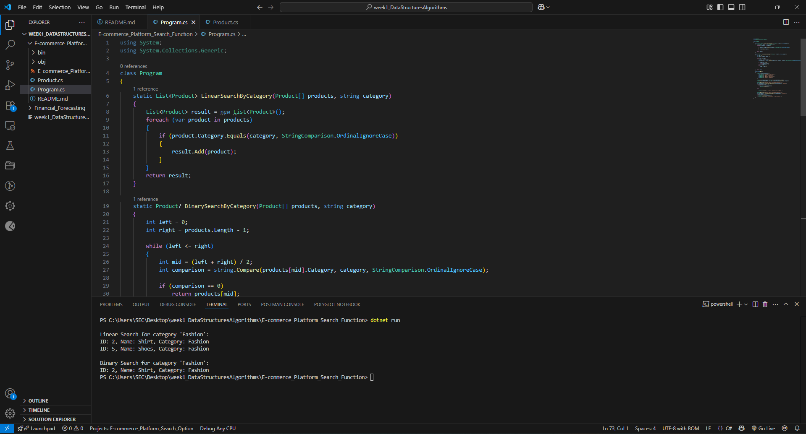

# E-commerce Platform – Product Search Function

## Scenario: 
You are working on the search functionality of an e-commerce platform. The search needs to be optimized for fast performance.

## Steps:
### 1.Understand Asymptotic Notation:
  oExplain Big O notation and how it helps in analyzing algorithms.
oDescribe the best, average, and worst-case scenarios for search operations.
### 2. Setup:
  oCreate a class Product with attributes for searching, such as productId, productName, and category.
### 3. Implementation:
oImplement linear search and binary search algorithms.
  oStore products in an array for linear search and a sorted array for binary search.
### 4.Analysis:
oCompare the time complexity of linear and binary search algorithms.
oDiscuss which algorithm is more suitable for your platform and why.

## Aim
To implement efficient search functionality using Linear and Binary Search in C# for an e-commerce platform.

---

## Understanding Big O Notation

- **Big O** measures the upper limit of an algorithm's time as input grows.
- Helps in comparing performance and scalability.

### Search Case Analysis

| Algorithm     | Best Case | Average Case | Worst Case |
|---------------|-----------|--------------|------------|
| Linear Search | O(1)      | O(n)         | O(n)       |
| Binary Search | O(1)      | O(log n)     | O(log n)   |

---

## Project Structure

- **Product.cs** – Defines the `Product` class (ID, Name, Category).
- **Program.cs** – Contains:
  - Linear search method
  - Binary search method
  - Sample product list
  - Demo output using both algorithms

---

## HOW TO RUN:
1. Open terminal in the project directory.
  


2. Run main code:
   ```bash
   dotnet run


## OUTPUT:

