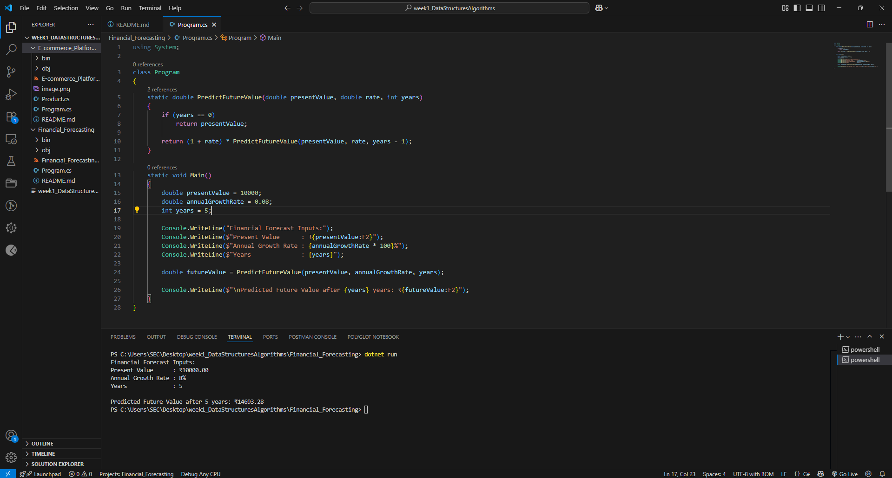

#  Exercise 7: Financial Forecasting using Recursion

## Scenario: 
You are developing a financial forecasting tool that predicts future values based on past data.
## Steps:
### 1.Understand Recursive Algorithms:
oExplain the concept of recursion and how it can simplify certain problems.
### 2.Setup:
oCreate a method to calculate the future value using a recursive approach.
### 3.Implementation:
oImplement a recursive algorithm to predict future values based on past growth rates.
### 4.Analysis:
oDiscuss the time complexity of your recursive algorithm.
oExplain how to optimize the recursive solution to avoid excessive computation.

##  Aim
To develop a financial forecasting tool in C# that predicts future value using a recursive growth model based on past data.

---

##  Understanding Recursive Algorithms

###  What is Recursion?
Recursion is a method where a function calls itself to solve a smaller instance of the same problem. It's useful for breaking down problems into simpler subproblems.

###  Why Use It in Financial Forecasting?
- Models time-based problems naturally
- Each year’s value depends on the previous year’s result
- Clean and readable for growth-based computations

---

## Project Structure

- **Program.cs** – Contains:
  - `PredictFutureValue()` method (recursive)
  - Hardcoded sample input values (PV, rate, years)
  - Display of all inputs and predicted future value

---

## Formula Used

```text
FutureValue = PresentValue × (1 + rate) ^ years

```
## HOW TO RUN:

1. Open terminal in the project directory.
  


2. Run main code:
   ```bash
   dotnet run

## OUTPUT:


