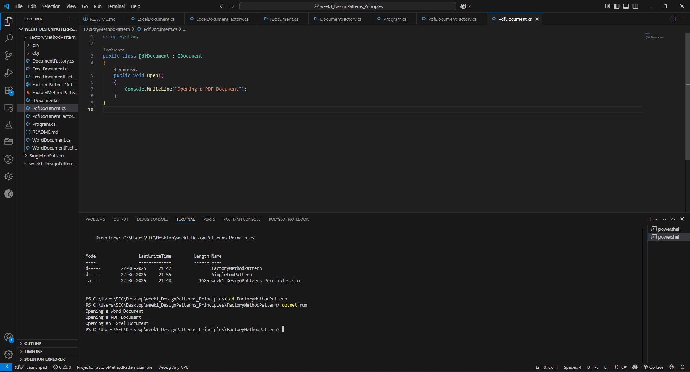

# Exercise 2: Implementing the Factory Method Pattern

## Scenario: 
You are developing a document management system that needs to create different types of documents (e.g., Word, PDF, Excel). Use the Factory Method Pattern to achieve this.
Steps:
### 1. Create a New Java Project:
oCreate a new Java project named FactoryMethodPatternExample.
### 2. Define Document Classes:
oCreate interfaces or abstract classes for different document types such as WordDocument, PdfDocument, and ExcelDocument.
### 3. Create Concrete Document Classes:
oImplement concrete classes for each document type that implements or extends the above interfaces or abstract classes.
### 4. Implement the Factory Method:
oCreate an abstract class DocumentFactory with a method createDocument().
oCreate concrete factory classes for each document type that extends DocumentFactory and implements the createDocument() method.
### 5. Test the Factory Method Implementation:
Create a test class to demonstrate the creation of different document types using the factory method.
## Aim
To implement the Factory Method Design Pattern in Java by creating a document management system that can generate different types of documents such as Word, PDF, and Excel, providing a flexible and extensible way to create objects without specifying their concrete classes.

## Objective
- To understand and apply the Factory Method Pattern.
- To create an abstract factory for creating document objects.
- To implement concrete factories for specific document types.
- To demonstrate how the Factory Method pattern promotes loose coupling and scalability in object creation.
- To enable easy addition of new document types without modifying existing code.

## Definition of Factory Method Pattern
The Factory Method Pattern is a creational design pattern that defines an interface for creating an object, but lets subclasses decide which class to instantiate. It allows a class to defer instantiation to subclasses, promoting loose coupling by eliminating the need to bind application-specific classes into the code.

---

## Project Structure
- `Document` (Interface): Declares the method(s) for document types.
- Concrete Document Classes: `WordDocument`, `PdfDocument`, `ExcelDocument` implement `Document`.
- `DocumentFactory` (Abstract class): Declares the factory method `createDocument()`.
- Concrete Factory Classes: `WordDocumentFactory`, `PdfDocumentFactory`, `ExcelDocumentFactory` extend `DocumentFactory` and implement `createDocument()`.

---

## How to Run

1. Open terminal in the project directory.
  


2. Run main code:
   ```bash
   dotnet run


## OUTPUT:




