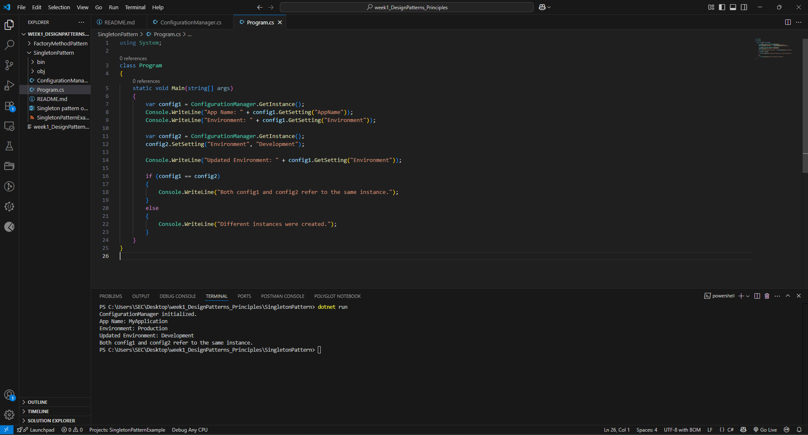

# Exercise 1: Implementing the Singleton Pattern

## Scenario: 
You need to ensure that a logging utility class in your application has only one instance throughout the application lifecycle to ensure consistent logging.
## Steps:
### 1. Create a New Java Project:
oCreate a new Java project named SingletonPatternExample.
### 2. Define a Singleton Class:
oCreate a class named Logger that has a private static instance of itself.
oEnsure the constructor of Logger is private.
oProvide a public static method to get the instance of the Logger class.
### 3. Implement the Singleton Pattern:
oWrite code to ensure that the Logger class follows the Singleton design pattern.
### 4. Test the Singleton Implementation:
oCreate a test class to verify that only one instance of Logger is created and used across the application.

## Aim
To implement the Singleton Design Pattern in Java by creating a logging utility that ensures only one instance of the logger exists throughout the application lifecycle, providing a global point of access to consistent logging.

## Objective
- To understand and apply the Singleton Design Pattern.
- To ensure that a class has only one instance and provides a global point of access to it.
- To demonstrate how Singleton helps in maintaining a shared state across the application.
- To show how thread-safe Singleton can be implemented in Java.

## Definition of Singleton Pattern
The Singleton Pattern is a **creational design pattern** that restricts the instantiation of a class to one object and provides a global point of access to it. It ensures that a class has only one instance and controls access to it.

---

## Project Structure
- `Logger` (Singleton Class): 
  - Has a private static instance of itself.
  - Private constructor to restrict object creation.
  - Public static method `getInstance()` to access the single instance.
- `Main` (Client Class): 
  - Demonstrates that multiple calls to `getInstance()` return the same instance.

---

## How to Run

1. **Open your terminal and navigate to the project folder.**

2. **Run the Main class:**
   ```bash
   dotnet run

## OUTPUT:



